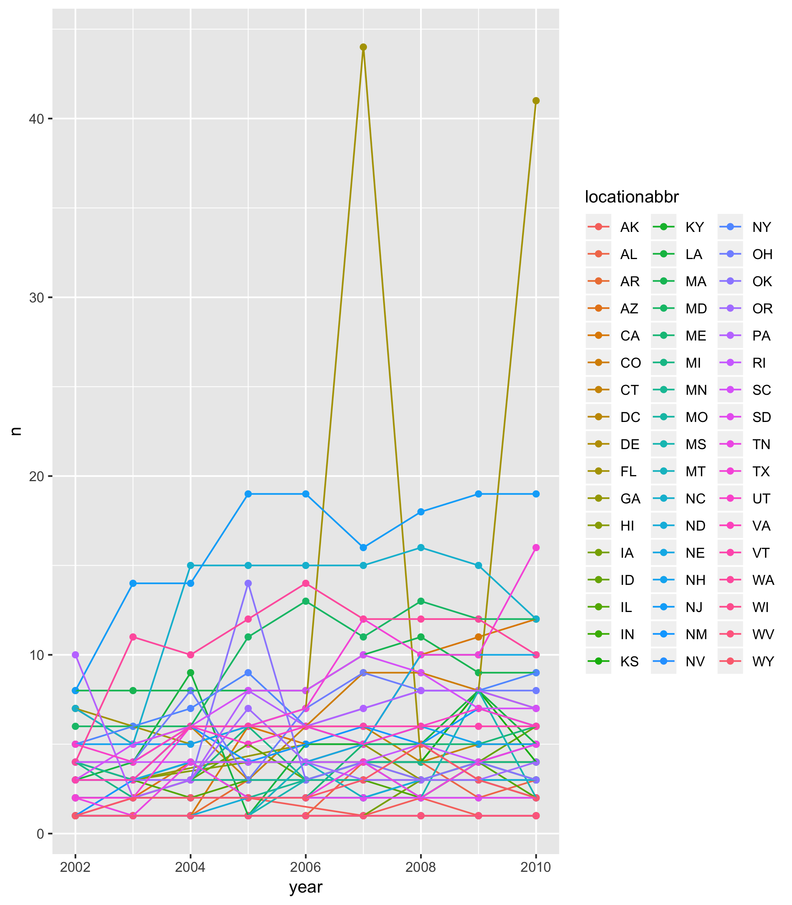
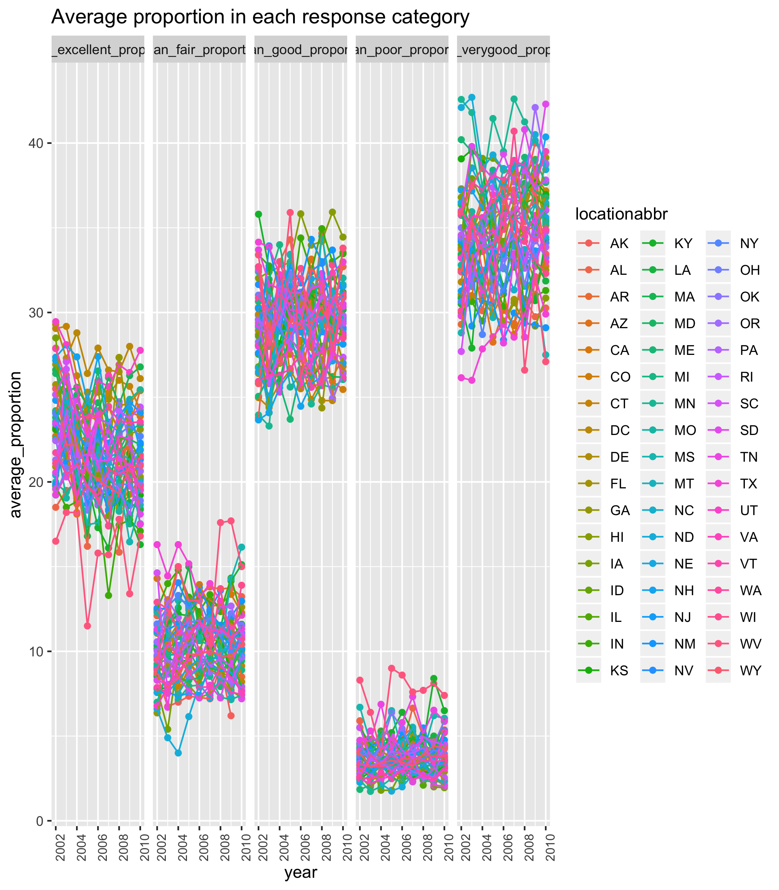
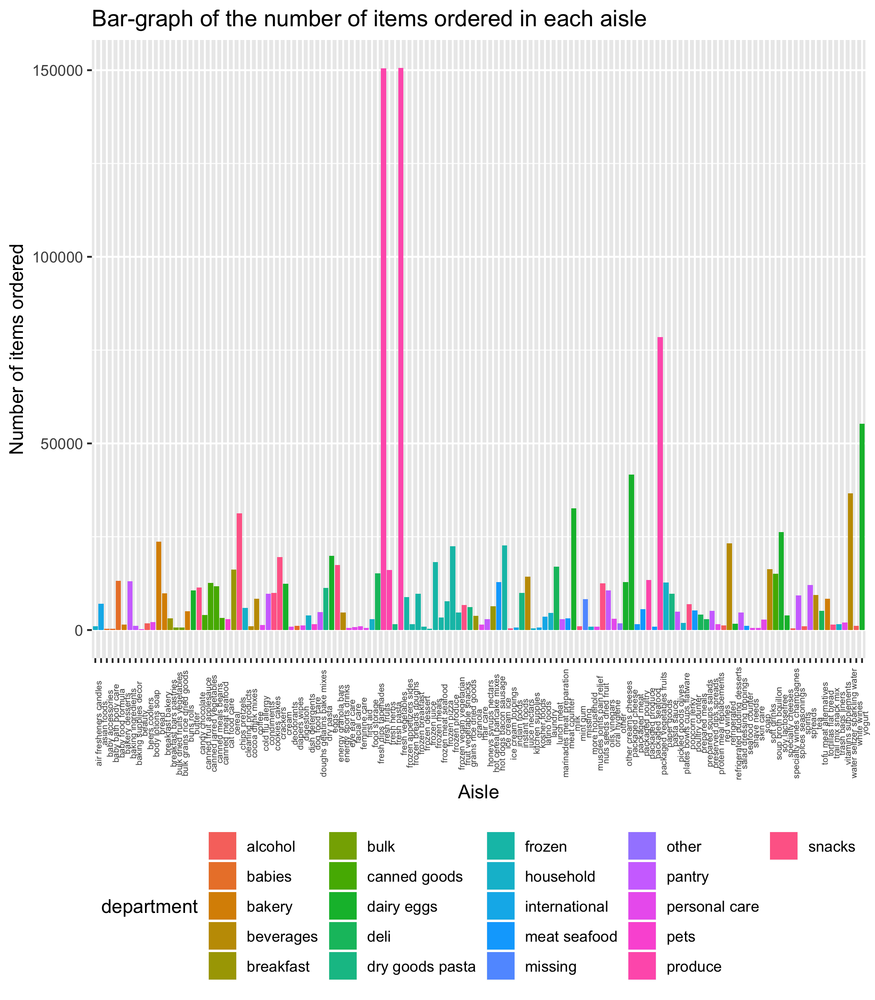
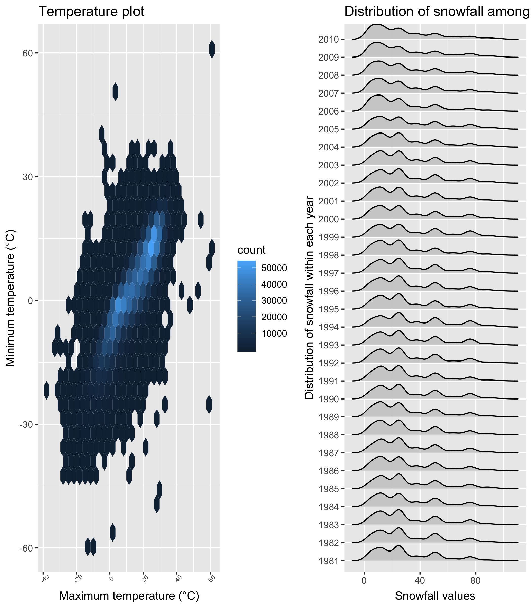

p8105\_hw3\_mm5354
================
Mengran Ma
2018/10/3

Problem 1
=========

``` r
data("brfss_smart2010")
brfss = janitor::clean_names(brfss_smart2010) %>% 
  #Focus on the “Overall Health” topic
  filter(topic == "Overall Health") %>% 
  #include only responses from “Excellent” to “Poor” (i.e. no pre-collapsed categories)
  filter(response == "Excellent" | response == "Very good" | response == "Good" | response == "Fair" | response == "Poor") %>%
  #organize responses as a factor taking levels from “Excellent” to “Poor”
  spread(., key = "response", value = "data_value")
```

In 2002, which states were observed at 7 locations?

``` r
filter(brfss, year == 2002) %>% 
  group_by(locationabbr) %>% 
  summarize(location_num = length(unique(locationdesc))) %>% 
  filter(location_num == 7)
```

    ## # A tibble: 3 x 2
    ##   locationabbr location_num
    ##   <chr>               <int>
    ## 1 CT                      7
    ## 2 FL                      7
    ## 3 NC                      7

**In 2002, CT, FL, and NC, these three states were observed at 7 locations**

Make a “spaghetti plot” that shows the number of locations in each state from 2002 to 2010.

``` r
brfss %>%
  group_by(locationabbr, year) %>% 
  summarize(n = n_distinct(locationdesc)) %>% 
  ggplot(aes(x = year, y = n, color = locationabbr)) + 
    geom_point() + 
    geom_line()
```



**Most states contain less than 20 distinct locations (some even contain less than 10 different locations) from 2002 to 2010.**

Make a table showing, for the years 2002, 2006, and 2010, the mean and standard deviation of the proportion of “Excellent” responses across locations in NY State.

``` r
filter(brfss, brfss$locationabbr == "NY") %>% 
  filter(., year == 2002 | year == 2006 | year == 2010) %>% 
  group_by(year) %>% 
  summarize(mean_proportion = mean(Excellent, na.rm = TRUE), 
       sd_proportion = sd(Excellent, na.rm = TRUE)) %>% 
  knitr::kable(digits = 4)
```

|  year|  mean\_proportion|  sd\_proportion|
|-----:|-----------------:|---------------:|
|  2002|           24.0400|          4.4864|
|  2006|           22.5333|          4.0008|
|  2010|           22.7000|          3.5672|

**The mean proportions of “Excellent” responses across locations in NY State are similar for 2006 and 2010. The standard deviation of the proportion of “Excellent” responses across locations in NY State is the greatest for 2002, and lowest for 2010**

For each year and state, compute the average proportion in each response category (taking the average across locations in a state). Make a five-panel plot that shows, for each response category separately, the distribution of these state-level averages over time.

``` r
brfss %>%
  group_by(year, locationabbr) %>% 
  summarize(mean_excellent_proportion = mean(Excellent, na.rm = TRUE),
         mean_verygood_proportion = mean(`Very good`, na.rm = TRUE),
         mean_fair_proportion = mean(Fair, na.rm = TRUE),
         mean_good_proportion = mean(Good, na.rm = TRUE), 
         mean_poor_proportion = mean(Poor, na.rm = TRUE)) %>% 
  gather(key = response_new, value = average_proportion, mean_excellent_proportion:mean_poor_proportion) %>% 
  ggplot(aes(x = year, y = average_proportion, color = locationabbr)) + 
    geom_point() + 
    geom_line() +
    labs(title = "Average proportion in each response category") +
    theme(axis.text.x = element_text(angle = 90, size = 8)) + 
    theme(legend.position = "right") +
    facet_grid(~response_new)
```



**The distribution of average proportions for each response category is pretty consistent whithin its own response category across different states. The mean proportions of each response type have roughly the same center across states across years from 2002 to 2010. This implies the mean proportion of each response stays on the same level across years. The distribution of average proportions of "Poor" responses has the least variation (also least range), while in contrast, the distribution of average proportions of "Very good" responses seems to have the greatest variation (also greatest range). This means that people who have gaven poor responses before, this opinion won't vary a lot across different years **

Problem 2
=========

``` r
data(instacart)
instacart_data = janitor::clean_names(instacart)
```

**The Instacart dataset consists of information about online grocery orders from instacart users. The size and structure of the data, which is dimension: 1384617 rows x 15 columns, with each row in the dataset represents a product from an order. Each product is identified by "product\_id" and each customer has the unique "user\_id". When one product has been ordered by the same customer in the past, the"reordered" column shows 1.**

How many aisles are there, and which aisles are the most items ordered from?

``` r
length(unique(instacart_data$aisle))
```

    ## [1] 134

``` r
names(which.max(table(instacart_data$aisle)))
```

    ## [1] "fresh vegetables"

``` r
most_items_order_aisles = filter(instacart_data, aisle != "fresh vegetables")
names(which.max(table(most_items_order_aisles$aisle)))
```

    ## [1] "fresh fruits"

**There are 134 aisles recorded in the dataset. Most items are ordered from aisle fresh vegetables and aisle fresh fruits. On one hand, it reflects that people tend to have healthy eating habits like eating greater amount of fresh vegetables and fruits. On the other hand, it indicates that fresh vegetables & fruits are in large demands in the market.**

Make a plot that shows the number of items ordered in each aisle. Order aisles sensibly, and organize your plot so others can read it.

``` r
ggplot(instacart_data, aes(x = aisle, fill = department)) + 
  geom_bar() +
  labs(
      title = "Bar-graph of the number of items ordered in each aisle",
      x = "Aisle",
      y = "Number of items ordered"
    ) +
  theme(legend.position = "bottom") +
  theme(axis.text.x = element_text(angle = 90, size = 5))
```



**According to this Bar Graph, "Produce" is an aisle that is most popular among all the aisles because it has the greatest number of items ordered from this aisle. Fresh vegetables, fresh fruits, and packaged vegetables fruits are characterized as the top 3 greatest ordered items/products which all belong to this "Produce" aisle**

Make a table showing the most popular item in each of the aisles “baking ingredients”, “dog food care”, and “packaged vegetables fruits”.

``` r
most_pop_item_aisles = instacart_data %>%
  filter(., aisle == "baking ingredients") %>% 
  group_by(aisle) %>% 
  count(.,product_name)
Most_pop_baking = tail(data.table(most_pop_item_aisles, key = "n"),1)


most_pop_item_aisles = instacart_data %>%
  filter(., aisle == "dog food care") %>% 
  group_by(aisle) %>% 
  count(.,product_name)
Most_pop_dog = tail(data.table(most_pop_item_aisles, key = "n"),1)

most_pop_item_aisles = instacart_data %>%
  filter(., aisle == "packaged vegetables fruits") %>% 
  group_by(aisle) %>% 
  count(.,product_name)
Most_pop_veg = tail(data.table(most_pop_item_aisles, key = "n"),1)

rbind(Most_pop_baking, Most_pop_dog, Most_pop_veg) %>% 
  knitr::kable(digits = 2)
```

| aisle                      | product\_name                                 |     n|
|:---------------------------|:----------------------------------------------|-----:|
| baking ingredients         | Light Brown Sugar                             |   499|
| dog food care              | Snack Sticks Chicken & Rice Recipe Dog Treats |    30|
| packaged vegetables fruits | Organic Baby Spinach                          |  9784|

**Reading from the summary table above, light brown sugar is the most popular item in "baking ingredients" aisle since brown sugar is a very common cooking ingredient for a variety of baking products. For dog food care, Snack Sticks Chicken & Rice Recipe Dog Treats are the most popular. Organic baby spinach is characterized as the top of popularity on the packaged vegerables fruits.**

Make a table showing the mean hour of the day at which Pink Lady Apples and Coffee Ice Cream are ordered on each day of the week; format this table for human readers (i.e. produce a 2 x 7 table).

``` r
instacart_data %>%
  filter(product_name == "Pink Lady Apples" | product_name == "Coffee Ice Cream") %>% 
  group_by(product_name, order_dow) %>%
  summarize(mean_hour = mean(order_hour_of_day)) %>% 
  spread(key = order_dow, value = mean_hour) %>% 
  knitr::kable(digits = 5)
```

| product\_name    |         0|         1|         2|         3|         4|         5|         6|
|:-----------------|---------:|---------:|---------:|---------:|---------:|---------:|---------:|
| Coffee Ice Cream |  13.77419|  14.31579|  15.38095|  15.31818|  15.21739|  12.26316|  13.83333|
| Pink Lady Apples |  13.44118|  11.36000|  11.70213|  14.25000|  11.55172|  12.78431|  11.93750|

**My comment: People almost all ordered coffee ice cream in the afternoon time from 13:00 to 16:00 across whole week. Possibility of people ordering ice cream for break after morning work or maybe because of elevated temprature in the afternoon. Pink lady apples are ordered around noon.**

Problem 3
=========

``` r
data(ny_noaa)
noaa_data = janitor::clean_names(ny_noaa)
```

**The NOAA dataset provides weather data from stations around the world. The size and structure of the data, which is dimension: 2595176 rows x 7 columns. There are so many missing data exists since stations may not collect certain precipation or snow data. Some key variables are as the followings:** id: Weather station ID date: Date of observation prcp: Precipitation (tenths of mm) snow: Snowfall (mm) snwd: Snow depth (mm) tmax: Maximum temperature (tenths of °C) tmin: Minimum temperature (tenths of °C)

**Now, indicating the extent to which missing data is an issue. The numbers of missing values for each variable/column are as the following: ** **prcp: 145838** **snow: 381221** **snwd: 591786** **tmax: 1134358** **tmin: 1134420**

Do some data cleaning. Create separate variables for year, month, and day. Ensure observations for temperature, precipitation, and snowfall are given in reasonable units. For snowfall, what are the most commonly observed values? Why?

``` r
#Create separate variables for year, month, and day.
New_noaa_data = mutate(noaa_data, noaa_data$date, year = as.integer(format(noaa_data$date, format = "%Y")), month = as.integer(format(noaa_data$date, format = "%m")), day = as.integer(format(noaa_data$date, format = "%d")))

#Ensure observations for temperature, precipitation, and snowfall are given in reasonable units.
New_noaa_data = mutate(New_noaa_data,
  tmax = as.numeric(tmax) / 10, 
  tmin = as.numeric(tmin) / 10,
  prcp = as.numeric(prcp) / 10
)

#For snowfall, what are the most commonly observed values? Why?
names(which.max(table(New_noaa_data$snow)))
```

    ## [1] "0"

``` r
snowfall_most_observed = filter(New_noaa_data, snow != "0")
names(which.max(table(snowfall_most_observed$snow))) 
```

    ## [1] "25"

**The most commonly observed value for snowfall is 0, which shows that most of the time in NY does not snow. The second most commonly observed value for snowfall is 25**

Make a two-panel plot showing the average max temperature in January and in July in each station across years. Is there any observable / interpretable structure? Any outliers?

``` r
Jan_July_average = New_noaa_data %>%
  select(id, prcp, snow, snwd, tmax, tmin, year, month, day) %>% 
  filter(month == 1 | month == 7) %>% 
  filter(!is.na(tmax) | !is.na(tmin))

Jan_July_average %>% 
  group_by(id, year, month) %>%
  summarize(mean_tempmax = mean(as.numeric(tmax), na.rm = TRUE)) %>%
  ggplot(aes(x = year, y = mean_tempmax, color = id)) + 
    geom_point() + 
    geom_line() +
    labs(
      title = "Average temperature in each station across years",
      x = "Weather station ID",
      y = "Mean Maxiumum temperature (°C)"
      ) +
  theme(axis.text.x = element_text(angle = 45, size = 10)) +
  theme(legend.position = "none") +
  facet_grid(~month)
```

    ## Warning: Removed 1 rows containing missing values (geom_point).


**Clearly, we can conclude that the average maximum temperature in each station across years is definitely lower in January than in July. And the variation (range of variation) across different years for each station seems to be smaller for July and bigger for January.**

Make a two-panel plot showing (i) tmax vs tmin for the full dataset (note that a scatterplot may not be the best option); and (ii) make a plot showing the distribution of snowfall values greater than 0 and less than 100 separately by year.

``` r
# (i) tmax vs tmin for the full dataset
tmax_vs_tmin = New_noaa_data %>% 
  ggplot(aes(x = tmax, y = tmin)) + 
    geom_hex() +
    labs(
        title = "Temperature plot",
        x = "Maximum temperature (°C)",
        y = "Minimum temperature (°C)"
      ) +
  theme(axis.text.x = element_text(angle = 45, size = 6))

# (ii) make a plot showing the distribution of snowfall values greater than 0 and less than 100 separately by year
snowfall_distribution = New_noaa_data %>% 
  mutate(year = as.character(year)) %>% 
  filter(snow > 0 & snow < 100) %>%
  ggplot(aes(x = snow, y = year)) + 
    geom_density_ridges(scale = .9, alpha = .5) +
    labs(
      title = "Distribution of snowfall among different years",
      x = "Snowfall values",
      y = "Distribution of snowfall within each year"
    )
(tmax_vs_tmin + snowfall_distribution)
```

    ## Warning: Removed 1136276 rows containing non-finite values (stat_binhex).

    ## Picking joint bandwidth of 3.76



**The maximum temperatures tend to lie between 0 and 30 °C, while in contrast the minimum temperatures tend to lie within (-15 and 15) °C for the full dataset.The distributions of snowfall values greater than 0 and less than 100 separately by years are pretty consistent and remain mostly without large variations across different years.**
